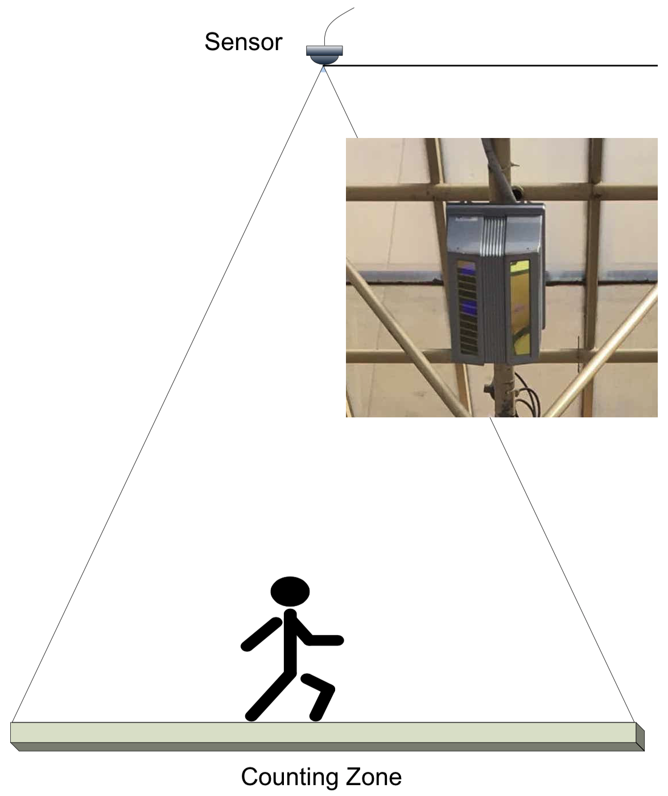
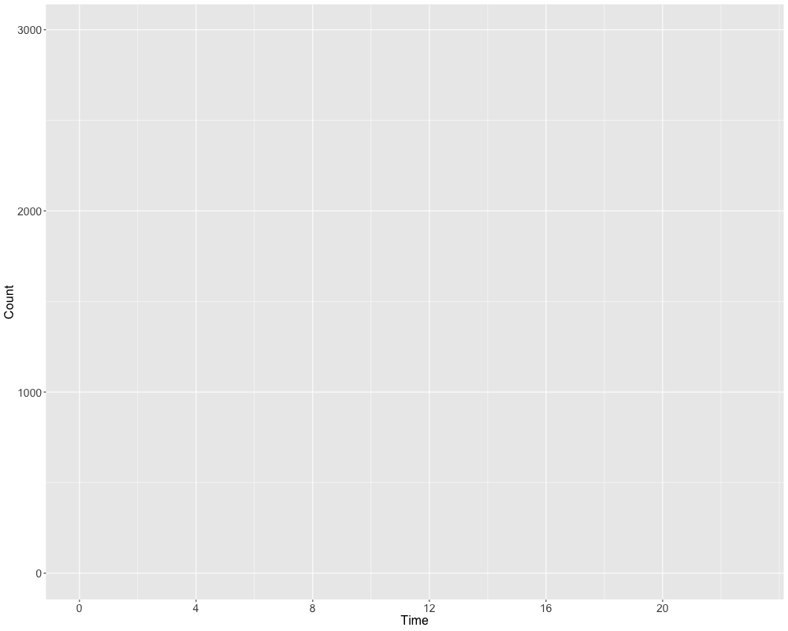
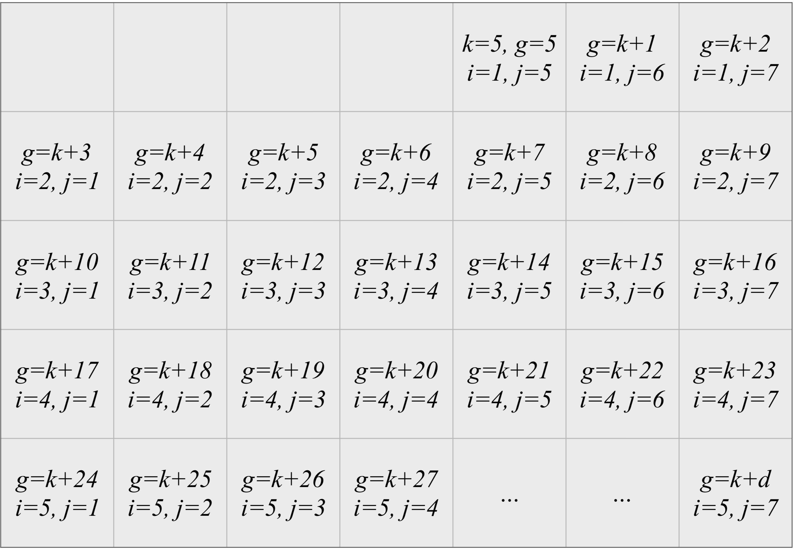
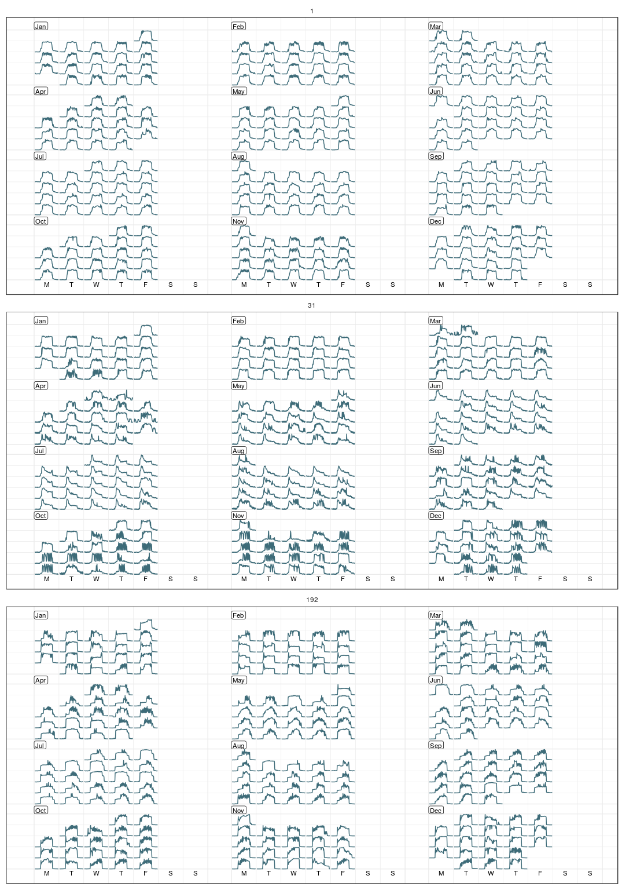

```{r initial, echo = FALSE, cache = FALSE, results = 'hide'}
library(knitr)
options(htmltools.dir.version = FALSE, tibble.width = 60, tibble.print_min = 6)
opts_chunk$set(
  echo = FALSE, warning = FALSE, message = FALSE, comment = "#>",
  fig.path = 'figure/', cache.path = 'cache/', fig.align = 'center', 
  fig.width = 12, fig.height = 11, fig.show = 'hold', 
  cache = TRUE, external = TRUE, dev = 'svglite'
)
read_chunk('R/theme.R')
read_chunk('R/main.R')
```

```{r theme-remark}
```

```{r load}
```

class: center

.pull-left[
```{r sensor-map, out.width = "100%", out.heigth = "50%"}
```
]
.pull-right[
## .blue[Melbourne <br> pedestrian counting sensors]
<br>

]

???

* automated system to understand the walking activities in downtown Melbourne, primarily for business purpose.
* put up 40+ sensors in the inner city, which covers shopping mall, train station, and outdoor park.
* expect different pedestrian patterns at different locations.
* a sensor either installed on the awing or street wall

---

.left-column[
<br>
<br>
<br>
<br>
<br>
<br>
## What is a typical working day like at Southern Cross Station?
]
.right-column[
<br>
<br>

]

???

* how the data looks like?
* One normal working day in last Jan
* expand time axis and put more and more data into this chart

---

.left-column[
<br>
<br>
<br>
<br>
<br>
<br>
<br>
<br>
<br>
<br>
## More and more
]
.right-column[
<br>
<br>
<br>
<video autoplay loop controls>
  <source src="img/sx17.mp4" type="video/mp4">
</video>
]

---

.left-column[
<br>
<br>
<br>
<br>
<br>
<br>
<br>
<br>
<br>
<br>
## Alternative display
]
.right-column[
```{r sx}
```

```{r sx-wrap}
```
]

---

class: inverse middle

## <i class="fas fa-walking"></i>  <i class="fas fa-walking"></i>  <i class="fas fa-walking"></i>  <i class="fas fa-walking"></i>  <i class="fas fa-walking"></i>  <i class="fas fa-swimmer"></i>  <i class="fas fa-swimmer"></i>  <i class="fas fa-walking"></i>  <i class="fas fa-walking"></i>  <i class="fas fa-walking"></i>  <i class="fas fa-walking"></i>  <i class="fas fa-walking"></i>  <i class="fas fa-swimmer"></i>  <i class="fas fa-swimmer"></i>  <i class="fas fa-walking"></i>  <i class="fas fa-walking"></i>  <i class="fas fa-walking"></i>  <i class="fas fa-walking"></i>  <i class="fas fa-walking"></i>

---

background-image: url(img/calendar.png)
background-size: cover

---

```{r sx-hol, include = FALSE}
```


background-image: url(figure/sx-hol-1.svg)
background-size: 100% 100%

---

### `sugrrants::frame_calendar()`

.pull-left[
<br>
<br>
<br>
<br>
* It's not a plotting function, but provides a data-restructuring tool.


* Its name draws inspiration from `tibble::frame_data()`, but the origin has shifted to `tibble::tribble()`.


* It needs a better meaning: frame the series into the calendar canvas.
]
.pull-right[
<br>
<br>
<br>
<br>
```{r sx-oct}
```
]

---

## Construction

.center[]
<br>
The grid position for any day in the month is given by

$$\begin{align}
i &= \lceil (g \mod 35) / 7\rceil \\ j &= g \mod 7.
\end{align}$$

Let $h$ and $c$ be the scaled hour and count, respectively, then the final
coordinates are given by:

$$\begin{align}
x &= j + h \\ y &= i - c.
\end{align}$$

---

## Map over each month

```r
*mday_x <- mday(x)
*month_x <- unique(x - mday_x + 1)
*if (sunday) { # Weekday starts with Sunday
*  first_wday <- wday(month_x, week_start = 7) # k
*} else { # starts with Monday
*  first_wday <- wday(month_x, week_start = 1) # k
*}
counter <- map2( # g
  .x = first_wday, .y = days_x, function(.x, .y) .x + 0:(.y - 1)
)
row_idx <- map( # i
  counter, 
  function(x) ifelse(x == ncells, max_wks, ceiling((x %% ncells) / ndays))
)
col_idx <- map( # j
  counter, 
  function(x) ifelse(x %% ndays == 0, ndays, x %% ndays)
)
```

---

.left-column[
## Easy to use
### - frame_calendar()
]
.right-column[
```{r sx-1, echo = TRUE}
```
]

---

.left-column[
## Easy to use
### - frame_calendar()
### - ggplot2
]
.right-column[
```{r sx-2b, eval = FALSE, echo = TRUE}
```
```{r sx-2, fig.height = 10}
```
]

---

.left-column[
## Easy to use
### - frame_calendar()
### - ggplot2
### - prettify()
]
.right-column[
```{r sx-3, echo = TRUE, fig.height = 10}
```
]

---

.left-column[
## Easy to use
### - frame_calendar()
### - ggplot2
### - prettify()
### - plotly
]
.right-column[
```{r sx-plotly, echo = TRUE, out.height = "90%", out.width="95%"}
```
]

---

## Options: calendar type

.pull-left[
`calendar = "weekly"`
<br>
<br>
```{r weekly, fig.height = 12}
```
]
.pull-right[
`calendar = "daily"`
<br>
<br>
```{r daily, fig.height = 12}
```
]

---

## Options: polar

.pull-left[
`polar = FALSE`
<br>
<br>
```{r linear, fig.height = 12}
```
]
.pull-right[
`polar = TRUE`
<br>
<br>
```{r polar, fig.height = 12}
```
]

---

## Multiple calendars

```{r multiple, fig.height = 7.5}
```

---

## Showcase

.pull-left[
Energy consumption

]
.pull-right[
Bus delay
<br>
<br>
<br>
<br>
<br>

.red[.footnote[left: Roach, C (forthcoming 2018). Assessing the impact of building characteristics on energy consumption using semiparametric mixed models. <br> right: [Tom Elliott's tweet](https://twitter.com/tomelliottnz/status/958887861943640064)]]
]

---

class: middle inverse

### The full range of plotting capabilities in ggplot2 is essentially available, from geom_line() to geom_ribbon().

--

### Patterns on special events, like Australian Day, or Australian Open, more easily pop out to the viewer as public holidays.

--

### Localize the calendar: other languages are supported for labels, like CJK.

.pull-left[
```{r chn}
```
]
.pull-right[
```{r fr}
```
]

---

class: inverse middle center

### Joint work with `r icon::fa_users()` [Di Cook](http://dicook.org) & [Rob J Hyndman](http://robjhyndman.com)

### More on sugrrants `r icon::fa_info_circle()` <http://pkg.earo.me/sugrrants>

### Slides created via xaringan <i class="fas fa-user-ninja"></i> <http://slides.earo.me/jsm18>

### Open source `r icon::fa_github()` [earowang/jsm18](https://github.com/earowang/jsm18)

### This work is under licensed [`r icon::fa("creative-commons")` BY-NC 4.0](https://creativecommons.org/licenses/by-nc/4.0/).
