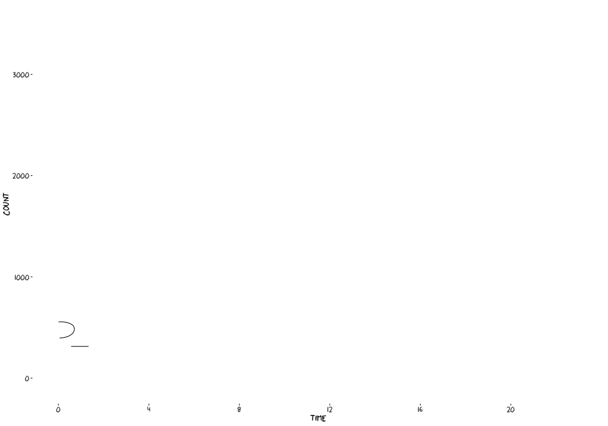

```{r initial, echo = FALSE, cache = FALSE, results = 'hide'}
library(knitr)
options(htmltools.dir.version = FALSE, tibble.width = 60, tibble.print_min = 6)
opts_chunk$set(
  echo = FALSE, warning = FALSE, message = FALSE, comment = "#>",
  fig.path = 'figure/', cache.path = 'cache/', fig.align = 'center', 
  fig.width = 12, fig.height = 8.5, fig.show = 'hold', 
  cache = TRUE, external = TRUE, dev = 'svglite'
)
read_chunk('R/theme.R')
read_chunk('R/main.R')
```

```{r theme-remark}
```

```{r load}
```

class: center

## .blue[Melbourne pedestrian counting sensors]

.pull-left[
```{r sensor-map, out.width = "100%"}
```
]
.pull-right[

]

---

.left-column[
<br>
<br>
<br>
<br>
<br>
## What is a typical working day like at Southern Cross Station?
]
.right-column[

]

---

.left-column[
<br>
<br>
<br>
<br>
<br>
<br>
<br>
## More and more
]
.right-column[
<br>
<video autoplay loop controls>
  <source src="img/sx17.mp4" type="video/mp4">
</video>
]

---

.left-column[
<br>
<br>
<br>
<br>
<br>
<br>
<br>
## Alternative display
]
.right-column[
```{r sx}
```

```{r sx-wrap, fig.height = 9}
```
]

---

background-image: url(img/calendar.png)
background-size: 100% 100%

---

```{r sx-hol, include = FALSE}
```


background-image: url(figure/sx-hol-1.svg)
background-size: 100% 100%

---

# `sugrrants::frame_calendar()`

.pull-left[
<br>
* It's not a plotting function, but provides a data-restructuring tool.


* Its name draws inspiration from `tibble::frame_data()`, but the origin has shifted to `tibble::tribble()`.


* It needs a better meaning: frame the series into the calendar canvas.
]
.pull-right[
```{r sx-oct, fig.height = 12}
```
]

---

.left-column[
## Easy to use
### - `frame_calendar()`
]
.right-column[
```{r sx-1, echo = TRUE}
```
]

---

.left-column[
## Easy to use
### - `frame_calendar()`
### - ggplot2
]
.right-column[
```{r sx-2b, eval = FALSE, echo = TRUE}
```
```{r sx-2, fig.height = 8}
```
]

---

.left-column[
## Easy to use
### - `frame_calendar()`
### - ggplot2
### - `prettify()`
]
.right-column[
```{r sx-3, echo = TRUE, fig.height = 8}
```
]

---

.left-column[
## Easy to use
### - `frame_calendar()`
### - ggplot2
### - `prettify()`
### - plotly
]
.right-column[
```{r sx-plotly, eval = FALSE, echo = TRUE}
```
]

---

.left-column[
## Easy to use
### - `frame_calendar()`
### - ggplot2
### - `prettify()`
### - plotly
]
.right-column[
```{r sx-plotly}
```
]

---

## Options: calendar type

.pull-left[
`calendar = "weekly"`
<br>
<br>
```{r weekly, fig.height = 10}
```
]
.pull-right[
`calendar = "daily"`
<br>
<br>
```{r daily, fig.height = 10}
```
]

---

## Options: polar

.pull-left[
`polar = FALSE`
<br>
<br>
```{r linear, fig.height = 10}
```
]
.pull-right[
`polar = TRUE`
<br>
<br>
```{r polar, fig.height = 10}
```
]

---

## Multiple calendars

---

## Showcase

---

class: inverse middle center

### Slides created via xaringan `r emo::ji("crossed_swords")` <http://slides.earo.me/jsm18>

### Open source <https://github.com/earowang/jsm18>

### This work is under licensed [`r icon::fa("creative-commons")` BY-NC 4.0](https://creativecommons.org/licenses/by-nc/4.0/).
